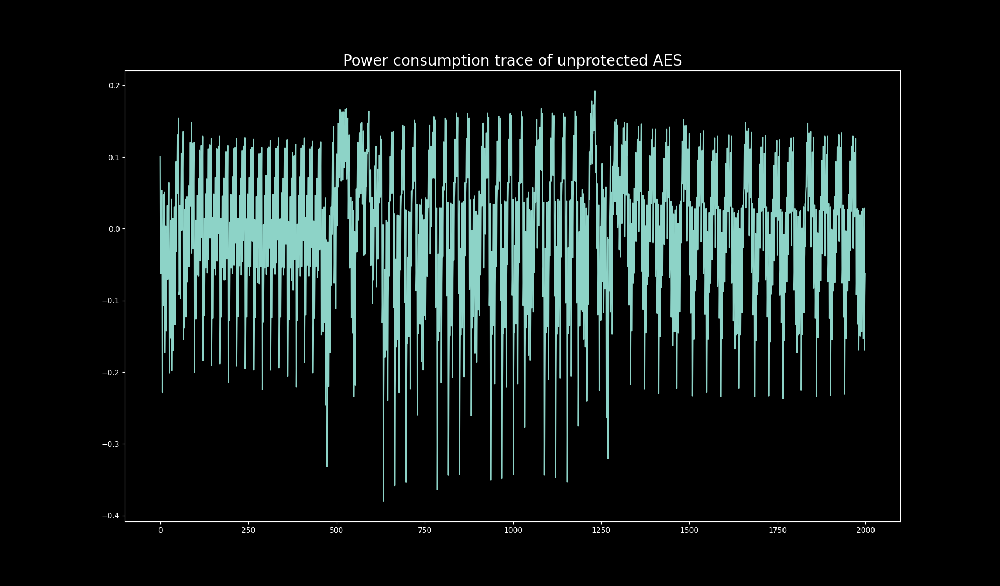
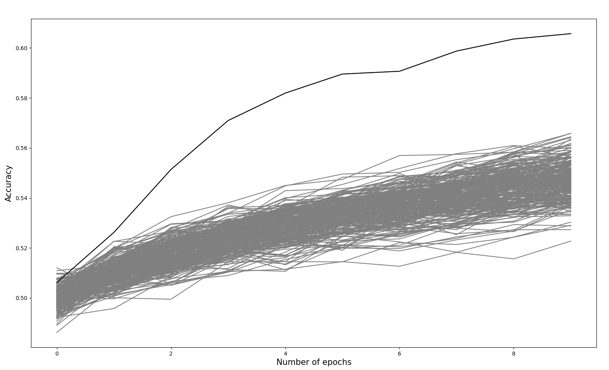

## SCADL: A new tool from the Donjon related to side-channel attacks (SCAs) using deep learning (DL)

The Donjon presents you a new in-house tool for performing SCAs using DL. This project has been developed within the research activities of the Donjon team (Ledger's security team), to help us during side-channel evaluations.

# Introduction

Deep learning based side-channel attacks (DL-SCAs) are considered as
a very powerful alternative to the well-known template attack for its ability to break protected cryptographic implementations. It has been adopted by most certification labs as an evaluation tool. 
SCADL [1] is an open source tool that implements the most state-of-the-art techniques. It integrates the following techniques: 

- Normal profiling: A straightforward profiling technique as the attacker will use a known-key dataset to train a DL model. Then, this model is used to attack the unknown-key data set. This technique was presented by the following work: [1](https://eprint.iacr.org/2016/921) and [2](https://eprint.iacr.org/2018/053).
- [Non-profiling](https://tches.iacr.org/index.php/TCHES/article/view/7387): A similar technique to differential power analysis ([DPA](https://paulkocher.com/doc/DifferentialPowerAnalysis.pdf)) but it has the several advantages over DPA to attack protected designs (masking and desynchronization).
- [Multi-label](https://eprint.iacr.org/2020/436): A technique to attack multiple keys using only one DL model.  
- [Multi-tasking](https://eprint.iacr.org/2023/006.pdf): Another technique for attacking multiple keys using a single model.
- Data augmentation: A technique to increase the dataset to boost the DL efficiency. Scadl includes [mixup](https://eprint.iacr.org/2021/328.pdf) and [random-crop](https://blog.roboflow.com/why-and-how-to-implement-random-crop-data-augmentation/).
- [Attribution methods](https://eprint.iacr.org/2019/143.pdf): A technique to perform leakage detection using DL.

# Tutorial using known datasets
Scadl uses two different datasets for its tutorial. The first dataset is collected by running a non-protected AES on [ChipWhisperer-Lite](https://rtfm.newae.com/Targets/CW303%20Arm/). The second dataset is [ASCAD](https://github.com/ANSSI-FR/ASCAD/tree/master/ATMEGA_AES_v1) which is widely used in the side-channel attacks (SCAs) domain.



# Examples

As we mentioned before, scadl implements different types of DL-based attacks and here is an example of how to use scadl for non-profiling DL in the cases of ASCAD dataset. 

```python
import sys
from pathlib import Path
import h5py
import keras
import matplotlib.pyplot as plt
import numpy as np
from keras.layers import Dense, Input
from keras.models import Sequential
from tqdm import tqdm
from scadl.non_profile import NonProfile
from scadl.tools import normalization, remove_avg, sbox

TARGET_BYTE = 2


def leakage_model(data: np.ndarray, guess: int) -> int:
    """It calculates lsb"""
    return 1 & ((sbox[data["plaintext"][TARGET_BYTE] ^ guess]))


def mlp_ascad(len_samples: int) -> keras.Model:
    """It returns an mlp model"""
    model = Sequential()
    model.add(Input(shape=(len_samples,)))
    model.add(Dense(20, activation="relu"))
    model.add(Dense(10, activation="relu"))
    model.add(Dense(2, activation="softmax"))
    model.compile(loss="mean_squared_error", optimizer="adam", metrics=["accuracy"])
    return model


if __name__ == "__main__":
    if len(sys.argv) != 2:
        print("Need to specify the location of training data")
        exit()
    dataset_dir = Path(sys.argv[1])

    # Load traces and metadata for training
    SIZE_TEST = 15000
    file = h5py.File(dataset_dir / "ASCAD.h5", "r")
    leakages = np.array(file["Profiling_traces"]["traces"][:], dtype=np.int8)[
        0:SIZE_TEST
    ]
    metadata = file["Profiling_traces"]["metadata"][:][0:SIZE_TEST]
    correct_key = metadata["key"][0][TARGET_BYTE]

    # Subtract average from traces + normalization
    x_train = normalization(remove_avg(leakages), feature_range=(-1, 1))

    # Non-profiling DL
    EPOCHS = 10
    guess_range = range(0, 256)
    acc = np.zeros((len(guess_range), EPOCHS))
    profile_engine = NonProfile(leakage_model=leakage_model)
    for index, guess in enumerate(tqdm(guess_range)):
        acc[index] = profile_engine.train(
            model=mlp_ascad(x_train.shape[1]),
            x_train=x_train,
            metadata=metadata,
            hist_acc="accuracy",
            guess=guess,
            num_classes=2,
            epochs=EPOCHS,
            batch_size=1000,
            verbose=0
        )
    guessed_key = np.argmax(np.max(acc, axis=1))
    print(f"guessed key = {guessed_key}")
    plt.plot(acc.T, "grey")
    plt.plot(acc[correct_key], "black")
    plt.xlabel("Number of epochs")
    plt.ylabel("Accuracy ")
    plt.show()
```



One of the main reasons for open-sourcing this project is to help students, security researchers, and security experts in evaluation labs. Therefore, we expect your contribution. 


**Done by Karim M. Abdellatif and Leo Benito**